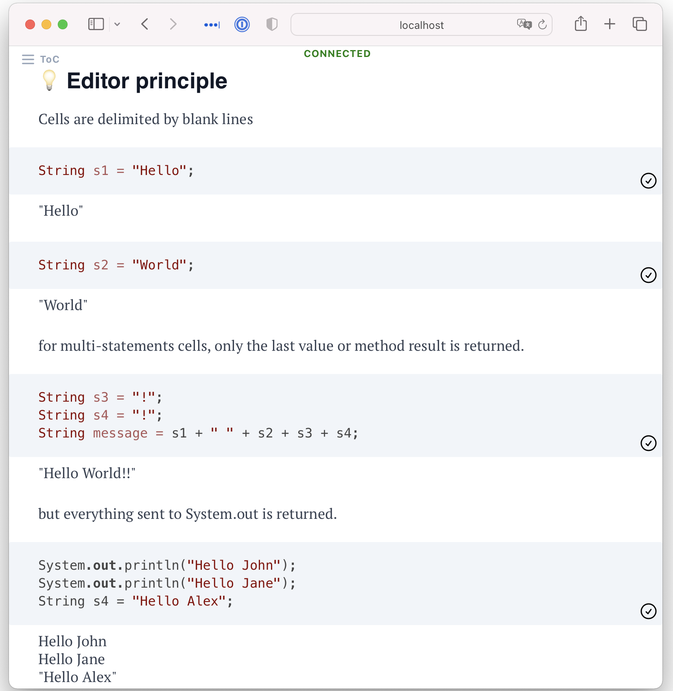

# jNotebook

## Live notebooks for Java.   

Book of jNotebook - Quickstart   

jNotebook interprets Java JShell files and render them as notebook.



## Rationale

Computational notebooks allow arguing from evidence by mixing prose with executable code. For a good overview of problems users encounter in traditional notebooks like Jupyter, see I don't like notebooks and What’s Wrong with Computational Notebooks? Pain Points, Needs, and Design Opportunities.

Specifically jNotebook wants to address the following problems:

- notebook editors are less helpful than IDE editors
- notebook code is hard to reuse
- out-of-order execution causes reproducibility issues
- notebook code is hard to version control
- the Java ecosystem does not provide a great experience for visualization and document formatting

jNotebook is a notebook library for Java that aims to address these problems by doing less, namely:

- no editing environment: you can keep the code editor you know and love
- (almost) no new format: jNotebook interprets JShell files and renders them as notebook.
    Because jNotebook is not required to run JShell files, you can create JShell scripts interactively with jNotebook, you won't depend on jNotebook in production later.
- no out-of-order execution: jNotebook always evaluates from top to bottom. jNotebook builds a dependency graph of Java statements and only recomputes the needed changes to keep the feedback loop fast.
- cells outputs are interpreted as html. This gives access to great visualization libraries and standard html for formatting.


## Developer
Set the log level to `DEBUG`: 
```
-Dorg.slf4j.simpleLogger.defaultLogLevel=debug
```
